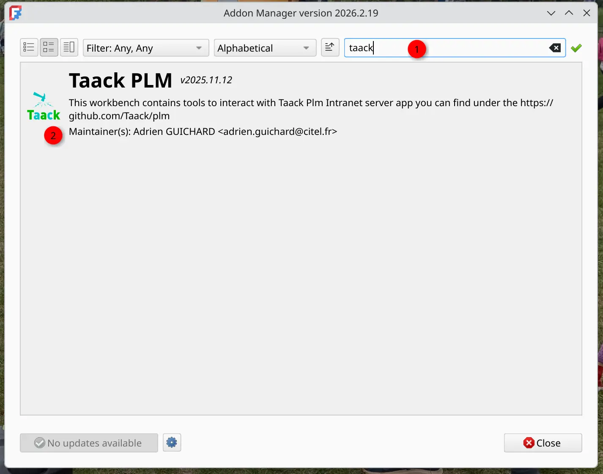
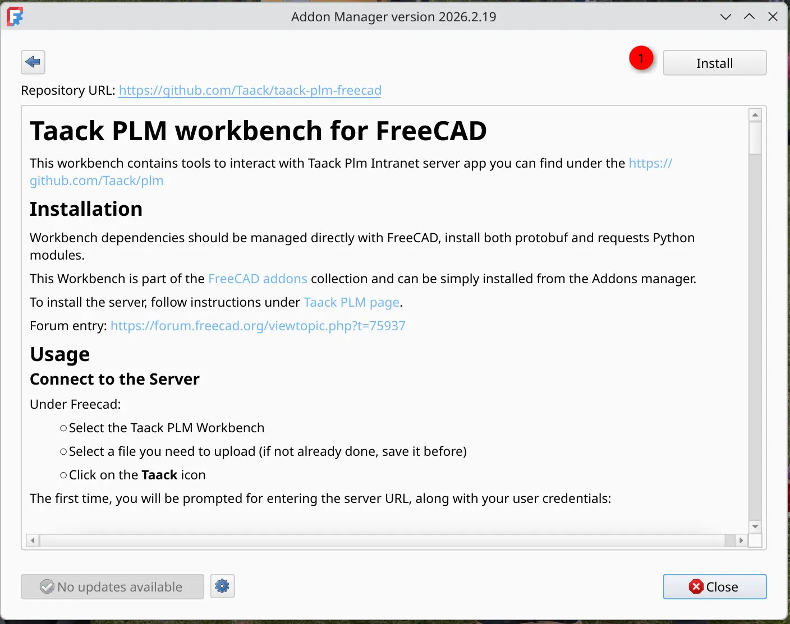
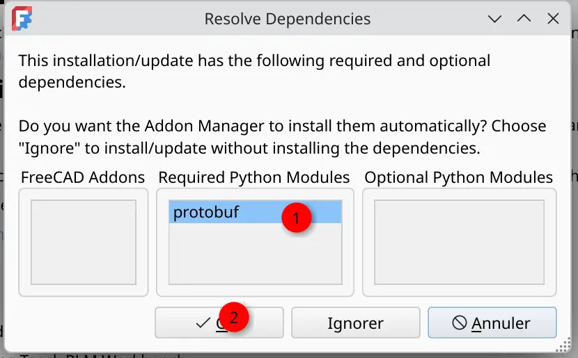
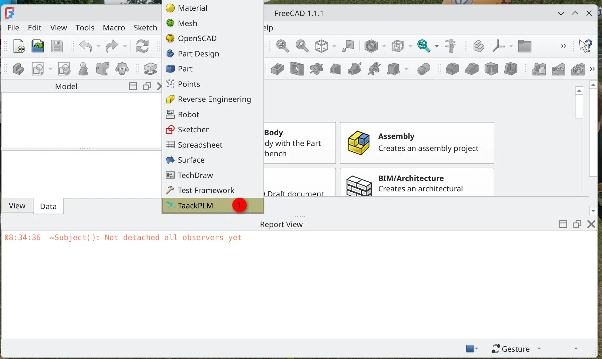
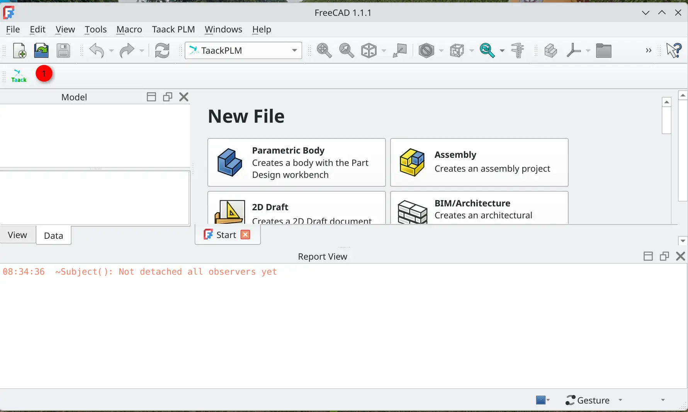
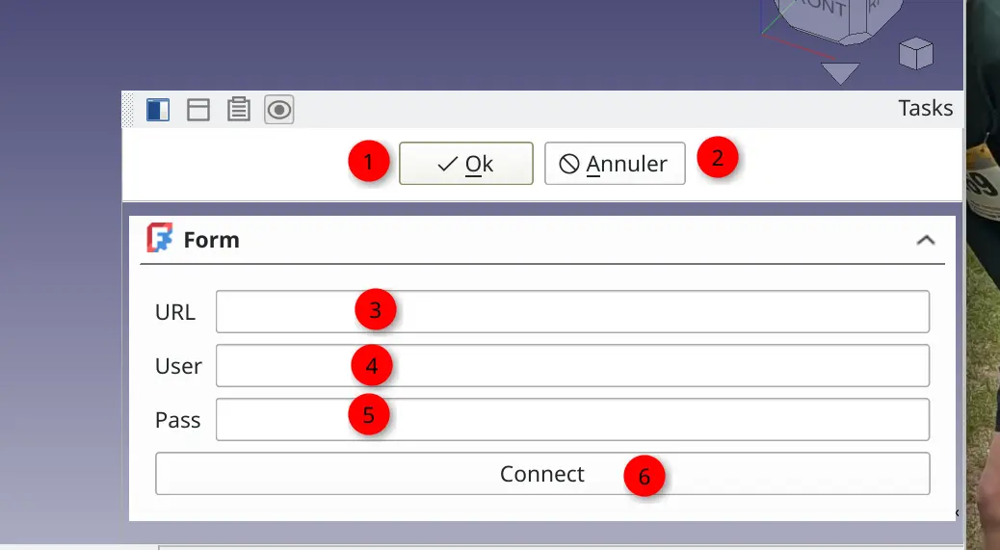

= FreeCAD PLM
:doctype: book
:taack-category: 2|App
:toc:
:icons: font
:experimental: true
:xrefdir: .

== Purpose

Manage FreeCAD model sharing and linear versioning.

== User guide

=== Install Taack PLM Plugin into Freecad

To install #Taack PLM# plugin, open the `Addon Manager` (menu:Tools[Addons Manager]).

.Search for `Taack`

<1> Saerch box
<2> Taack Entry

.Install #Taack PLM#

<1> Click on install

.Install deps

<1> Select `protobuf` dependency
<2> Validate

=== Launch Taack PLM

Then lets restart Freecad... Once restarted:

.Open Workbench

<1> Select the #TaackPLM# Workbench

.Small TaackPLM Icon

<1> Click on TaackPLM Icon

=== Upload a Model To the Server

Before submitting a model, connect FreeCAD to the server.

.TaackPLM Form

<1> btn:[OK] to upload the last save of the selected model with its dependencies
<2> btn:[Cancel]
<3> Server URL (add a `/` at the end !!)
<4> Server Credentials `useraname` like appearing in Crew app
<5> Server Credentials `passwd`
<6> The btn:[Connect] button

If the server is connected, the btn:[Connect] button will be green. Once green you can upload the model.